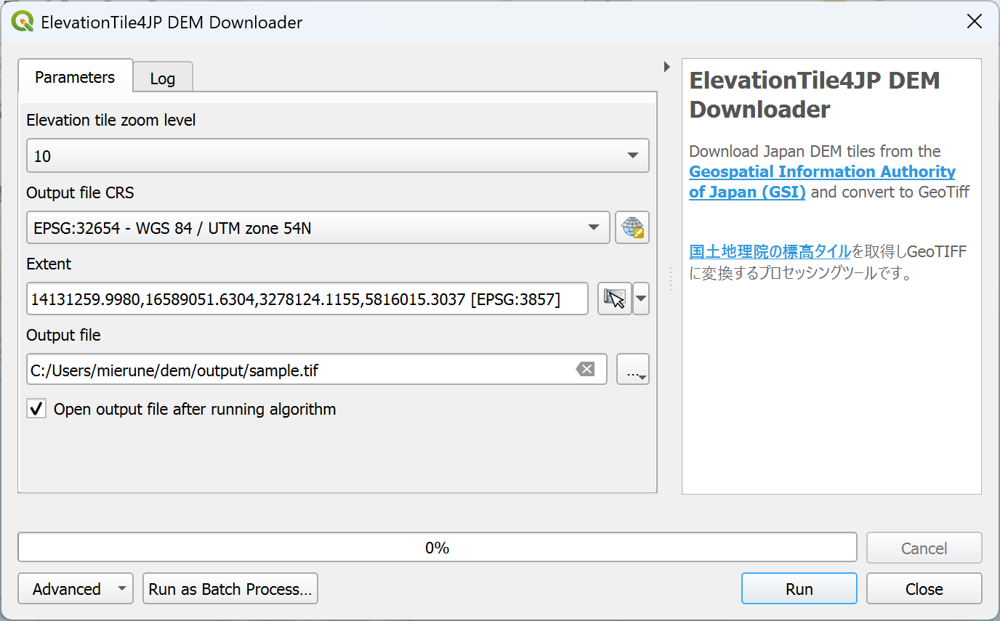

# ElevationTile4JP

## Overview
This is a QGIS plugin that downloads elevation tiles and converts them to GeoTiff.
 

## Usage

- Click plugin icon or select Plugin --> ElevationTile4JP in menu bar
- Select tiles zoom level
- Set the output file
- Select the output file CRS
- Set the area of interest. Area of interest can be set with:
  - Layer: target layer extent
  - Layout Map: target layout map extent
  - Bookmark: extent saved on bookmark
  - Map Canvas Extent: current map canvas extent
  - Draw on Canvas: draw customize extent on map canvas

- Click OK and the processed file will be added to the map canvas

## Data source
[Elevation tile](https://maps.gsi.go.jp/development/ichiran.html#dem) of [Geospatial Information Authority of Japan](https://www.gsi.go.jp/)

## Note
- This plugin is ready-to-use but the data source will be decimated during the process. If you need accurate data, use [QuickDEM4JP](https://github.com/MIERUNE/QuickDEM4JP).
- Downloadable tiles amount is limited to 1000.
- The original tile coordinate reference system is web mercator (EPSG:3857) and exported file will be reprojected to the input value.

---

### License
GNU GENERAL PUBLIC LICENSE 2